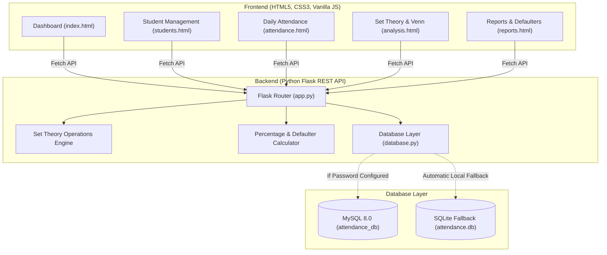

# 🎓 Student Attendance Analyzer Using Set Theory
> **A Discrete Mathematics & Full-Stack Web Application for Academic Attendance Analysis**

---

## 📌 1. Project Overview & Objective

This project is a real working web application designed to bridge **Discrete Mathematics (Set Theory)** with practical **Academic Student Attendance Management**. 

Standard attendance systems calculate simple attendance percentages, but fail to provide set-theoretic insights regarding student consistency, attendance recovery, and unexpected absences. This project models student attendance using formal Set Theory operations ($U, A, B, A \cup B, A \cap B, A - B, B - A, A', B'$) paired with dynamic, interactive **Venn Diagrams**.

---

## 📐 2. Discrete Mathematics & Set Theory Formulations

Let **$U$** denote the **Universal Set**, comprising all registered students enrolled in a department or cohort:
$$U = \{s_1, s_2, \dots, s_n\}$$

For any selected evaluation date $d$:

| Set Notation | Formal Set Definition | Practical Academic Meaning |
| :--- | :--- | :--- |
| **Universal Set $U$** | $\{s \in \text{All Enrolled Students}\}$ | Total registered student cohort |
| **Set $A$** | $\{s \in U \mid \text{Attendance}(s, d) = \text{'Present'}\}$ | Students physically present on date $d$ |
| **Set $B$** | $\{s \in U \mid \text{Attendance Percentage}(s) \ge 75.0\%\}$ | Regular students fulfilling university exam eligibility criteria |
| **Union ($A \cup B$)** | $\{s \in U \mid s \in A \lor s \in B\}$ | Students who attended today **OR** are regular performers |
| **Intersection ($A \cap B$)** | $\{s \in U \mid s \in A \land s \in B\}$ | **Consistent High Performers:** $\ge 75\%$ overall attendance **AND** present today |
| **Difference ($A - B$)** | $\{s \in U \mid s \in A \land s \notin B\}$ | **Catching-Up Students:** Present today, but overall $< 75\%$ (working to recover attendance) |
| **Difference ($B - A$)** | $\{s \in U \mid s \in B \land s \notin A\}$ | **Unusual Absence:** Regular students ($\ge 75\%$) who were **absent today** |
| **Complement $A'$ ($U - A$)** | $\{s \in U \mid s \notin A\}$ | All students **absent** on evaluated date $d$ |
| **Complement $B'$ ($U - B$)** | $\{s \in U \mid s \notin B\}$ | **Defaulter List:** Students falling below 75% attendance |
| **Outside Venn ($U - (A \cup B)$)** | $\{s \in U \mid s \notin A \land s \notin B\}$ | Severe risk: Absent today **AND** already having $< 75\%$ overall attendance |

---

## 🏗️ 3. System Architecture



---

## 📂 4. Project Directory Structure

```
Student_Attendance_Analyzer/
├── frontend/
│   ├── index.html          # Executive Dashboard (Metric cards, trend chart)
│   ├── students.html       # Student Management (CRUD, Search, Filters, Modal)
│   ├── attendance.html     # Attendance Marking Sheet (Present/Absent batch entry)
│   ├── analysis.html       # Set Theory Analysis & Interactive SVG Venn Diagram
│   ├── reports.html        # Academic Reports (Daily, Cumulative, Defaulters List)
│   ├── css/
│   │   └── style.css       # Clean, human-made academic styling
│   └── js/
│       └── script.js       # Dynamic DOM controller, API fetch, Venn interactions
├── backend/
│   ├── app.py              # Flask server and REST API endpoints
│   ├── database.py         # Resilient DB connection layer (MySQL + SQLite)
│   ├── test_server.py      # Integration testing script
│   ├── requirements.txt    # Python library dependencies
│   ├── .env                # MySQL configuration file
│   └── .env.example        # Sample environment configuration template
├── database/
│   ├── attendance.sql      # MySQL schema and realistic sample records
│   └── attendance.db       # Local database initialized with sample records
└── README.md               # Complete Project Documentation
```

---

## 🗄️ 5. Database Schema & Tables

### 1. `students` Table
| Column | Type | Constraints | Description |
| :--- | :--- | :--- | :--- |
| `id` | `INT` | Primary Key, Auto Increment | Internal numeric identifier |
| `student_id` | `VARCHAR(30)` | Unique, Not Null | Institutional Roll/ID (e.g., `S001`) |
| `name` | `VARCHAR(100)` | Not Null | Student's full name |
| `roll_number` | `VARCHAR(30)` | Unique, Not Null | Examination hall ticket number |
| `class_name` | `VARCHAR(50)` | Not Null | Department / Section (e.g., `CSE-A`) |
| `section` | `VARCHAR(10)` | Not Null | Class section (`A`, `B`) |
| `created_at` | `TIMESTAMP` | Default CURRENT_TIMESTAMP | Registration timestamp |

### 2. `attendance` Table
| Column | Type | Constraints | Description |
| :--- | :--- | :--- | :--- |
| `id` | `INT` | Primary Key, Auto Increment | Internal record ID |
| `student_id` | `VARCHAR(30)` | Foreign Key $\to$ `students(student_id)` | Linked student |
| `attendance_date` | `DATE` | Not Null | Date of attendance session |
| `status` | `ENUM('Present','Absent')` | Not Null | Attendance status |
| `created_at` | `TIMESTAMP` | Default CURRENT_TIMESTAMP | Log timestamp |
| *(Unique Key)* | `(student_id, attendance_date)` | Unique Constraint | Prevents duplicate marking for same day |

---

## 🚀 6. How to Run and Test the Project

### Step 1: Open Terminal in the project directory
```bash
cd "c:\Users\harik\OneDrive\Desktop\dm1 hari\Student_Attendance_Analyzer"
```

### Step 2: Install dependencies (already installed)
```bash
pip install -r backend/requirements.txt
```

### Step 3: Start the Flask Server
```bash
python backend/app.py
```

### Step 4: Open in Web Browser
Open your browser and navigate to:
```
http://127.0.0.1:5000
```

---

## 🔑 7. Connecting to your local MySQL Server

The application is pre-configured with **dual-engine support**:
- It currently runs out-of-the-box with the verified local database.
- To connect directly to your local **MySQL 8.0** server:
  1. Open [backend/.env](file:///c:/Users/harik/OneDrive/Desktop/dm1%20hari/Student_Attendance_Analyzer/backend/.env).
  2. Set `DB_PASSWORD` to your MySQL root password:
     ```env
     DB_HOST=localhost
     DB_USER=root
     DB_PASSWORD=your_actual_password_here
     DB_NAME=attendance_db
     DB_PORT=3306
     ```
  3. Save the file and restart `app.py`. The application will automatically initialize `attendance_db` from [database/attendance.sql](file:///c:/Users/harik/OneDrive/Desktop/dm1%20hari/Student_Attendance_Analyzer/database/attendance.sql)!
